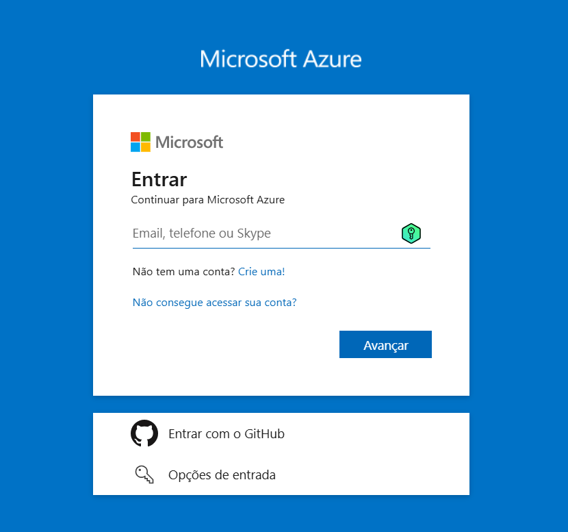
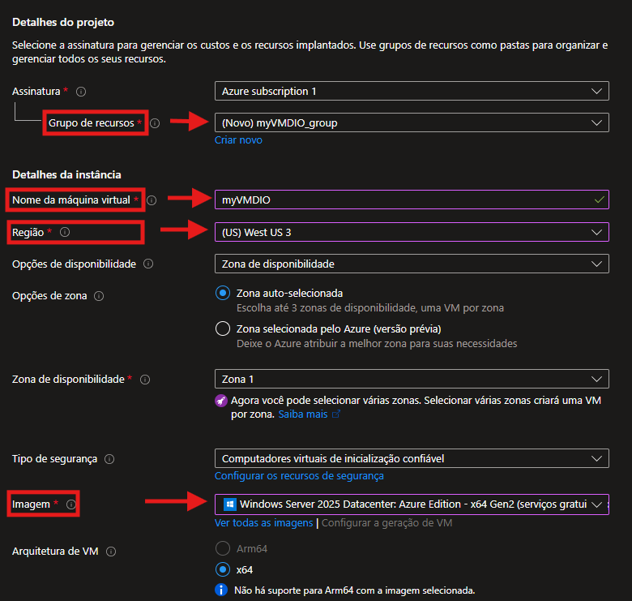
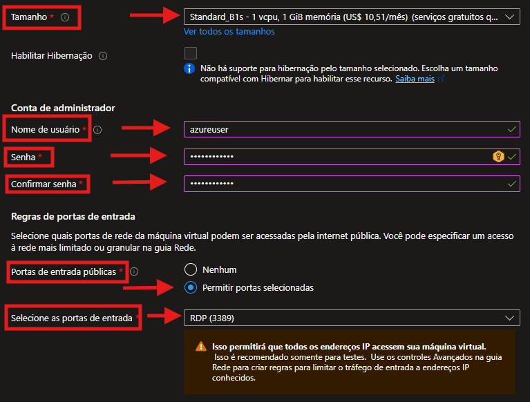
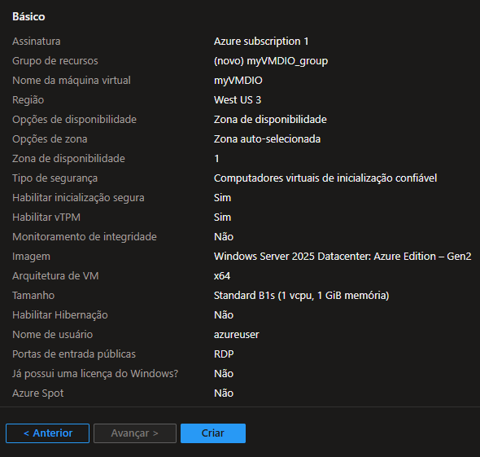

# 💻 Criação e Configuração de uma Máquina Virtual no Microsoft Azure

Este repositório foi criado como parte de um desafio prático com o objetivo de documentar o processo de criação de uma máquina virtual (VM) no Microsoft Azure. Aqui você encontrará **resumos**, **anotações**, **dicas úteis** e, opcionalmente, **capturas de tela** que ilustram cada etapa do processo.

## 📚 Referência Oficial

> Baseado no guia oficial da Microsoft:  
> [Criar uma máquina virtual Windows no portal do Azure - Microsoft Learn](https://learn.microsoft.com/pt-br/azure/virtual-machines/windows/quick-create-portal)

---

## 🧾 Sumário

- [Pré-requisitos](#pré-requisitos)
- [Passo a Passo](#passo-a-passo)
  - [1. Acessar o Portal do Azure](#1-acessar-o-portal-do-azure)
  - [2. Criar um novo recurso](#2-criar-um-novo-recurso)
  - [3. Configurar a máquina virtual](#3-configurar-a-máquina-virtual)
  - [4. Revisar e criar](#4-revisar-e-criar)
  - [5. Acessar a VM via RDP](#5-acessar-a-vm-via-rdp)
- [Dicas Úteis](#dicas-úteis)
- [Imagens](#imagens)
- [Autor](#autor)

---

## ✅ Pré-requisitos

- Conta Microsoft com acesso ao [portal do Azure](https://portal.azure.com/)
- Assinatura ativa no Azure (ou conta gratuita)
- Navegador atualizado

---

## 🛠️ Passo a Passo

### 1. Acessar o Portal do Azure

Acesse o portal do Azure em: [https://portal.azure.com](https://portal.azure.com)

> 

---

### 2. Criar um novo recurso

- Clique em **"Criar um recurso"**
- Selecione **Máquina Virtual** > **Windows Server 2022 Datacenter** (ou versão de sua escolha)

> 

---

### 3. Configurar a máquina virtual

- **Grupo de Recursos**: crie um novo ou escolha um existente  
- **Nome da VM**: defina um nome descritivo  
- **Região**: escolha uma próxima de você  
- **Tamanho da VM**: escolha de acordo com seu objetivo (por exemplo, B1s)  
- **Usuário e Senha**: anote as credenciais de acesso

> 
> 

---

### 4. Revisar e criar

- Clique em **"Revisar + criar"**
- Verifique todas as informações
- Clique em **"Criar"**

> 

---

### 5. Acessar a VM via RDP

- Após a criação, vá para a VM
- Clique em **"Conectar"** > **RDP**
- Baixe o arquivo `.rdp` e acesse com suas credenciais

> 

---

## 💡 Dicas Úteis

- Utilize **nomenclaturas claras** para grupos de recursos e VMs.
- A máquina virtual pode ser pausada para economizar créditos.
- Sempre use **senhas fortes** e mantenha o acesso **restrito por IP**, quando possível.
- Você pode usar o **Azure Bastion** para acesso mais seguro sem expor portas RDP.

---

## 🖼️ Imagens

Todas as imagens capturadas durante a execução do desafio estão organizadas na pasta [`/images`](images/).  
Sinta-se à vontade para explorar os passos com base nelas.

---

## 👨‍💻 Autor

Desafio realizado por [Seu Nome Aqui] no contexto de estudos da plataforma Microsoft Azure.

---

